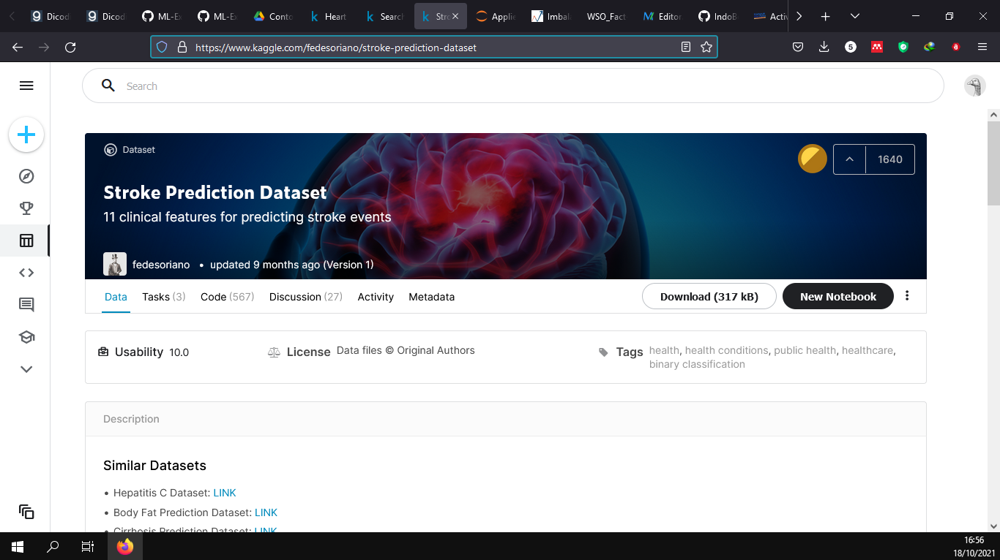
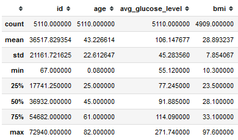
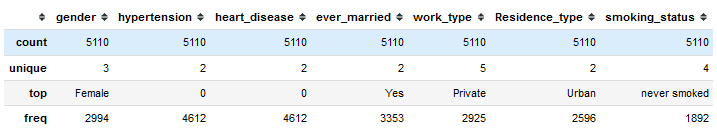
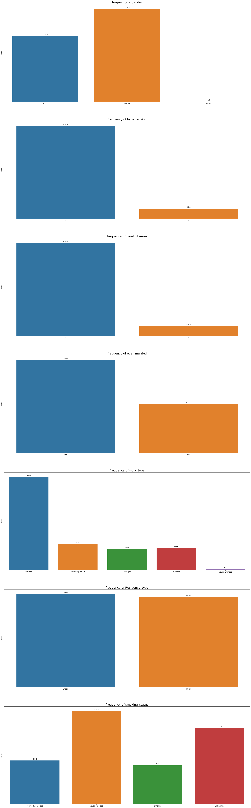
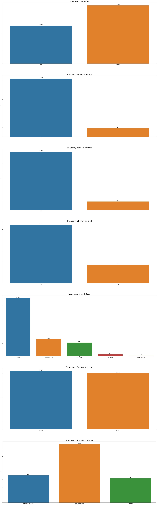
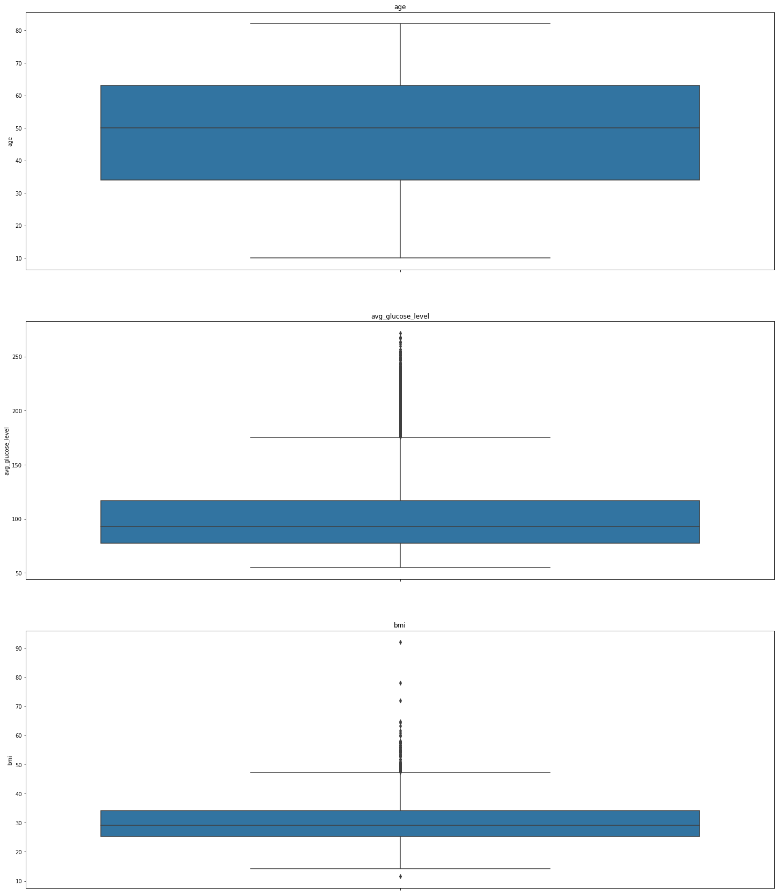
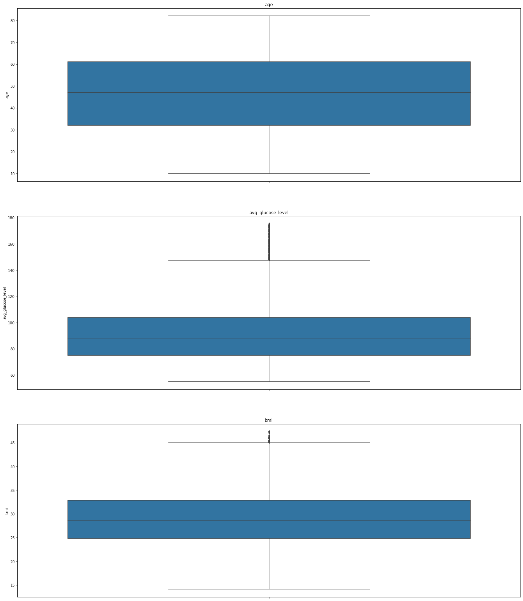
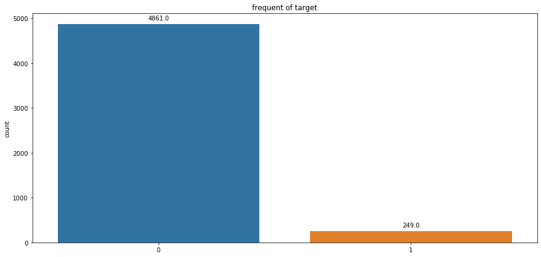
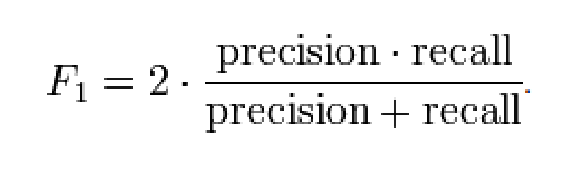

# Laporan Proyek Machine Learning - Ahmad Habib Husaini

## Domain Project
Domain proyek yang dipilih dalam proyek machine learning ini adalah mengenai kesehatan dengan judul proyek **Prediction positive or negative diabetes**. 

- Pendahuluan
  
  Kesehatan merupakan salah satu masalah umum yang telah ditetapkan dalam SDG (*Sustainable Development Goals)* oleh PBB. Saat ini sebagian manusia memiliki keinginan untuk hidup sehat tetapi lupa untuk menjaga pola hidup. Mengkonsumsi makanan cepat saji salah satu pola hidup tidak sehat, makanan yang mengandung lemak tinggi, makan dengan porsi yang banyak, merokok, olahraga  yang  tidak  teratur  dan  kurangnya  beristirahat. Kebiasaan seperti  ini  akan  berdampak pada  kesehatan  dan  menimbulkan  berbagai  macam penyakit diantaranya penyakit sistem peredaran darah, salah satunya yang sering terjadi yaitu stroke. Stroke merupakan penyakit atau gangguan fungsional otak berupa kelumpuhan  saraf  (*deficit  neurologic*)  akibat  terhambatnya  aliran  darah  ke  otak. Stroke  mengakibatkan beberapa gangguan pada penderita, diantaranya  ingatan  jadi  terganggu  dan  terjadi penurunan  daya  ingat, menurunkan  kualitas  hidup  penderita  juga  kehidupan keluarga  dan  orang-orang  di  sekelilingnya,  mengalami  penurunan  kualitas  hidup yang  lebih  drastis,  kecacatan  fisik  maupun  mental  pada  usia  produktif  dan  usia lanjut dan kematian dalam waktu singkat [(Junaidi 2011)](https://books.google.co.id/books?hl=id&lr=&id=n_HuDwAAQBAJ&oi=fnd&pg=PP1&dq=junaidi+2011+stroke&ots=c_iN-iuhMG&sig=AoiZpoiM4Wc0rEEl0gyBXnc4VKk&redir_esc=y#v=onepage&q=junaidi%202011%20stroke&f=false). Menurut WSO (*World Stroke Organization*) pada [Global Stroke Fact Sheet](https://www.world-stroke.org/assets/downloads/WSO_Fact-sheet_15.01.2020.pdf) 2019 menyatakan setiap tahunnya ada 13 juta kasus baru, oleh sebab itu perlu adanya suatu cara yang dapat memprediksi seseorang terjangkit stroke atau tidak berdasarkan data-data pasien sebelumnya. Data tersebut dapat diklasifikasi dengan *machine learning*.  
  
  *Machine learning* merupakan sebuah teknik yang mempelajari kumpulan  data  dan menghasilkan  aturan  untuk dapat mengenali atau memprediksi data  baru  yang  belum  dipelajari. Namun bagaimana jika data yang tersedia tidak seimbang antara data pasien positif dan negatif atau disebut  dengan *imbalance data* . Data yang tidak seimbang atau *imbalance data* antar kelas mayoritas  dan  minoritas  dapat  menyebabkan  *bias*  atau kecendrungan terhadap salah satu kelas dan mengakibatkan kesalahan dalam  melakukan  klasifikasi. Oleh sebab itu perlu adanya suatu cara untuk menangani kasus *imbalance data*. Dalam proyek ini akan dibuat sebuah model *machine learning* untuk mengklasifikasikan **pasien positif dan negatif stroke** dengan data yang tidak berimbang atau *imbalance data*. Dengan adanya model *machine learning* ini diharapkan dapat membantu para tenaga medis atau lebih spesifiknya dokter dalam mendiagnosis pasien stroke. 
# Business Understanding
### Problem Statement
Berdasarkan latar belakang yang sudah dipaparkan sebelumnya, berikut rincian masalah yang dapat diselesaikan dalam proyek ini : 
- Bagaimana cara melakukan *preprocessing* pada data yang tidak seimbang atau *imbalance data* untuk membuat model *machine learning* yang baik?
- Bagaimana cara membuat model *machine learning* untuk mengklasifikasikan pasien positif atau negatif stroke?
### Goals
- Melakukan *preprocessing* pada data yang tidak seimbang atau *imlanace data* untuk membuat model *machine learning* yang baik.
- Membuat model *machine learning* untuk mengklasifikasikan pasien positif atau negatif stroke.
### Solution Statements
Berikut Tahapan pada proyek ini dalam mengatasi persoalan klasifikasi pasien positif dan negatif stroke :
1. Mengatasi data yang salah dalam artian value atau nilainya tidak masuk akan. 
2. Mengatasi outlier dengan ***IQR method***. 
3. Membagi data *train* dan *test* dengan porsi 80% untuk *training* dan 20% untuk *testing*. 
4. Mengisi data kosong, untuk data numerik menggunakan median atau nilai tengah sedangkan untuk kategorik menggunakan modus atau nilai yang sering muncul. 
5. Melakukan transformasi **yeo-johnson** pada kolom numerik .Yeo-johnson merupakan salah satu cara dalam menangani skew (condong) pada data numerik dengan mentransformasikan data agar berdistribusi normal. 
6. Melakukan *scaling* dengan **Robust Scaler**. Menurut dokumentasi [sklearn](https://scikit-learn.org/stable/modules/generated/sklearn.preprocessing.RobustScaler.html) robust scaler melakukan *scaling* dengan cara menghapus median dan menskalakan data sesuai dengan rentang kuartil (default ke IQR: Rentang Interkuartil). IQR adalah rentang antara kuartil 1 (kuartil ke-25) dan kuartil ke-3 (kuartil ke-75). 
7. Melakukan *encoding* atau merepresentasikan data kategorik menjadi angka dengan **Ordinal Encoder**. 
8. Mengatasi *imbalance data* dengan melakukan teknik resample **SMOTE** atau *Synthetic Minority Oversampling Technique* . Teknik jenis dari **smote** pada proyek ini menggunakan pendekatan KNN, cara kerjanya sama dengan mengukur kedekatan dengan tetangga dalam menciptakan data *dummy*. 
9. *Modeling* dengan algoritma **random forest**. Random forest merupakan salah satu teknik *ensemble learning*, yakni menggabungkan teknik-teknik *machine learning* tradisional seperti *decision tree* dengan melakukan pembelajaran secara bersamaan. Untuk detail mekanisme bagaimana cara kerja dari *random forest* silahkan mengunjungi tautan [berikut](https://www.ibm.com/cloud/learn/random-forest). 
10. Melakukan *hyperparameter tuning* dengan **RandomizedSearchCV**. Proses *hyperparameter tuning* merupakan salah satu cara untuk meng-improve performa model. Tiap algoritma memiliki *hyperparameter* yang berbeda-beda, untuk detail apa saja parameter yang akan di *tuning* akan dijelaskan lebih lanjut pada tahapan *modeling*. **RandomizedSearch** memilih secara random parameter pada rentan yang nanti akan didefinisikan ditambah dengan kfold-cross validation yang sudah terintegrasi dalam **RandomizedSearchCV**. kfold menggambarkan berapa banyak lipatan yang diinginkan pada dataset, untuk lebih jelasnya silahkan kunjungi tautan [berikut](https://towardsdatascience.com/what-is-cross-validation-60c01f9d9e75). 
11. Pada prakteknya tahapan 4 hingga 9 dilakukan dengan membuat pipeline pada **library scikit-learn**. Dengan pipeline proses akan menjadi lebih simple  karena proses dilakukan otomatis sesuai alur yang didefinisikan. 
# Data Understanding

Pada berkas yang diunduh pada link [berikut](https://www.kaggle.com/fedesoriano/stroke-prediction-dataset) berisikan informasi pasien sebanyak 5110 data dengan 12 kolom serta terdapat 201 *missing values*. Untuk detail dari masing masing kolom adalah sebagai berikut :

Attribute  | Keterangan
------------- | -------------
ID | merupakan nomor unik dari masing-masing pasien
Gender | merupakan jenis kelamin (male, female, other(**dianggap invalid data**)) dari pasien
Hypertension | merupakan status apakah pasien menderita darah tinggi, nol jika pasien tidak menderita darah tinggi dan satu untuk sebaliknya.
Heart disease | merupakan status pasien apakah pernah menderita penyakit jantung. Nol jika pasien tidak menderita penyakit jantung dan satu untuk sebaliknya 
Ever married |merupakan status pernikahan pasien *yes* jika pernah, *no* jika belum
Work type | merupakan jenis pekerjaan dari pasien yang terdiri dari anak-anak, pekerjaan pemerintah, tidak pernah bekerja, swasta atau wiraswasta
Residence type | merupakan jenis tempat tinggal pasien apakah Rural (pedesaan) atau Urban (perkotaan) 
Avg glucose type | merupakan rata-rata kadar gula dalam darah pasien
BMI | merupakan indeks masa tubuh dari pasien
Smoking status | merupakan status apakah pasien formerly smoked (Sebelumnya merokok), never smoked (tidak pernah merokok), smokes (merokok) atau "Unknown" (**dianggap invalid data**)
Stroke | merupakan variabel target yang berisi status pasien apakah stroke atau tidak. satu jika pasien positif stroke dan dan nol untuk sebaliknya 

Berikut rangkuman `statistik deskriptif` dari fitur dalam dataset:  

Berikut `Visualisasi` tiap kolom : 

 
 
  
 
 `Kesimpulan yang dapat diambil dari visualisasi:`

1. Data target tidak seimbang antara pasien positif dan negatif
2. Data dengan value gender other dianggap **invalid data** 
3. Data dengan value smoking_status unknown akan dihapus
4. Pada kolom numerik terdapat cukup banyak outlier
5. Kolom numerik masih condong atau skew

# Data Preparation
- Mengatasi data yang salah
  pada proses visualisasi disimpulkan bahwa *gender* other merupakan data yang salah karena jenis kelamin pada umumnya hanya dua yakni pria dan wanita, hal ini bisa saja disebabkan karena kesalahan dalam proses input dan semisalnya. Sema halnya pada kolom smoking_status nilai unknown, namun pada kasus ini dapat dianggap menjadi missing values juga. Pada proyek ini nilai smoking_status = unknown akan dianggap *invalid data* sehingga akan dihapus. 
  
- Mengatasi pencilan atau *outlier*
  Pada tahapan ini berguna untuk menghapus data tidak normal pada dataset dengan menggunakan teknik IQR method. IQR merupakan *interquartile* yang dapat diformulasikan Q3 - Q1. Untuk mendeteksi pencilan langkah pertama mengalikan IQR dengan 1.5. Kemudian tentukan batas bawah dan batas atas dengan cara, batas bawah = Q1 - 1.5 * IQR dan batas atas = Q3 + 1.5 * IQR. Maka data yang bukan outlier adalah data yang berapa pada rentang batas bawah hingga batas atas. Untuk lebih jelasnya silahkan kunjungi tautan [berikut](https://online.stat.psu.edu/stat200/lesson/3/3.2). 
  
- Membagi data menjadi data *training* dan *testing*

  Tahapan ini bertujuan agar model yang dilatih dapat diuji dengan data yang berbeda dari data yang digunakan dalam pelatihan. Data dapat dibagi menjadi dua atau tiga, pada proyek ini data dibagi menjadi dua dengan persentase untuk *training* sebesar 80% dan sisanya 20% untuk testing. Fungsi [train_test_split](https://scikit-learn.org/stable/modules/generated/sklearn.model_selection.train_test_split.html) pada library sklearn yang akan digunakan untuk menangani tahapan ini.

- Mengatasi data kosong  

  

  Tahapan ini bertujuan untuk mengisi data yang tidak lengkap atau data kosong. Ada dua pilihan yang dapat diambil yakni menghapus data atau mengisi data dengan nilai rata-rata, nilai tengah atau nilai yang sering muncul, tergantung pada kasus. 

  

  Pada proyek ini dalam mengatasi data kosong dengan cara memberi nilai median karena hanya kolom bmi yang berupa nilai *continuous* yang memiliki data kosong. Alasan mengapa memilih untuk memberi nilai daripada menghapus karena pada data positif stroke terdapat nilai kosong yang mana merupakan kategori minoritas dalam proyek ini jika dihilangkan akan membuat data positif stroke menjadi semakin segikit. 

- Transformasi pada fitur *numeric*

  Pada tahapan visualisasi sebelumnya terlihat bahwa kolom-kolom numerik belum berdistribusi normal, untuk menanganinya tahapan ini dilakukan. Transformasi yang akan digunakan adalah *yeo-johnson*. Implementasi dalam code menggunakan fungsi pada sklearn yakni [PowerTransformer](https://scikit-learn.org/stable/modules/generated/sklearn.preprocessing.PowerTransformer.html) dengan mengatur *method* = 'yeo-johnson'. 

- Melakukan penyekalaan

  Tahapan ini untuk menyeragamkan skala dari kolom numerik. Mengapa hal tersebut penting ? contoh sederhananya misalkan ada kasus untuk menentukan tingkat kebahagiaan seseorang. Terdapat fitur gaji dan waktu libur, rentang nilai dari gaji berkisar dari 10.000.000 ke atas sedangkan waktu libur 1-5. jika melatih model dengan skala yang seperti itu dapat mengakibatkan salah satu fitur menjadi seakan tidak bermakna, oleh karenanya perlu ada penyekalaan. Dalam implementasinya pada proyek ini menggunakan [**Robust Scaler**](https://scikit-learn.org/stable/modules/generated/sklearn.preprocessing.RobustScaler.html) . Berdasarkan komparasi yang dilakukan oleh [scikit-learn](https://scikit-learn.org/stable/auto_examples/preprocessing/plot_all_scaling.html) *Robust Scaler* cocok terhadap data yang memiliki outlier karena ketika diterapkan pada data outlier tetap ada dan tidak menghilangkan makna dari data yang bukan outlier. 

- Transformasi pada kolom *categorical*

  Mesin hanya dapat membaca angka berupa nol dan satu,  oleh karenanya perlu adanya mekanisme untuk membuat mesin bisa menerima masukan berupa karakter, string maupun *object*. Proses transformasi pada fitur kategorikal sering kali disebut *encoding*. Banyak jenis cari *encoding* seperti yang umum digunakan adalah *OneHotEncoder*, namun jenis *encoding* tersebut membuat kolom atau fitur menjadi semakin banyak. Contohnya misalkan ingin melakukan encoding pada kolom yang memiliki 4 kategori makan setelah dilakukan *encoding* kolom atau fitur tersebut dipecah menjadi 4. Hal yang demikian dapat menyebabkan komputasi dalam pelatihan menjadi semakin lama. Oleh karenanya *encoding* yang digunakan pada proyek kali ini adalah *LabelEncoder*. Alasanya label encoder hanya mengubah kategori menjadi angka sebagai contoh status pendidikan sd menjadi 1, smp menjadi 2 dan seterusnya. 

- Melakukan teknik *resample* 
  Pada kasus klasifikasi dataset yang tidak seimbang akan membuat bias pada model yang cenderung mengarah pada kategori yang lebih banyak datanya. Walau jika diukur dari segi akurasi bisa jadi model memiliki akurasi yang tinggi, namun salah dalam memprediksi semua data minoritas. Hal tersebut menjadikan model tidak sesuai harapan. Oleh karenanya tahapan *resample* ini dilakukan, teknik ini membuat data *dummy* atau data buatan. Banyak cara atau metode atau teknik dalam tahapan resample, namun pada proyek ini teknik SMOTE atau **synthetic minority oversampling technique** yang bekerja dengan memanfaatkan algoritma KNN atau K-nearest-neighbor dengan memilih secara acak data dari kelas minoritas, kemudian mencari tetangga terdekat lalu membentuk beberapa data buatan di antara data dengan tetangganya. Dalam implementasi, proyek ini menggukan library [imblearn](https://imbalanced-learn.org/stable/references/generated/imblearn.over_sampling.SMOTE.html). 

- Membuat Pipeline
  Pada tahapan sebelumnya telah dipaparkan mengapa penting membagi data menjadi data *training* dan *testing*. Data *testing* haruslah data yang benar-benar belum pernah dilihat oleh model. Oleh karenanya pada tahap pre-processing seperti transformasi, penyekalaan harus dilakukan pada data testing saja. Jika penyelakaan atau transformasi dilakukan terhadap semua data dalam tanda kutip dilakukan sebelum pembagian data *train* dan *testing* akan menyebabkan kebocoran data yang dapat menyebabkan model menjadi overfit kedepannya. Kebocoran data adalah suatu momen ketika model sudah pernah melihat data *testing*. Bisa dianalogikan seperti seorang yang sedang berlatih untuk ujian dan mendapatkan bocoran mengenai ujian pertama, maka pada ujian pertama dia akan mendapatkan nilai yang baik namun jika ada ujian kedua belum tentu akan mendapat nilai yang baik. Oleh karenanya untuk mengukur seseorang menguasai materi dengan baik haruslah diuji dengan soal atau ujian yang belum pernah dikerjakan sebelumnya. Apa hubungannya dengan pipeline ? jika dalam *preprocessing*  tersebut dilakukan secara manual akan banyak sekali tahapan dan variabel yang perlu diingat. Sebagai contoh misal dalam menangani data kosong dengan rata-rata, nilai rata-rata tersebut harus diingat ketika ingin menyekalakan data *testing*. Library [scikit-learn](https://scikit-learn.org/stable/modules/generated/sklearn.pipeline.Pipeline.html) menyediakan pipeline untuk menangani  masalah ini, namun belum terintegrasi dengan library [imblearn](https://imbalanced-learn.org/stable/references/generated/imblearn.over_sampling.SMOTE.html), oleh karenanya pipeline yang digunakan adalah pipeline yang disegiakan oleh [imblearn](https://imbalanced-learn.org/stable/references/generated/imblearn.pipeline.Pipeline.html). Berikut ilustrasi dari salah satu pipeline dalam proyek ini. 

# Modeling

Setelah melakukan tahapan *preprocessing* makan data telah siap dimasukan kedalam model. Pada proyek ini dilakukan pembuatan model dengan empat strategi, pertama model tanpa *resampling* dan pembobotan pada target dengan *metrics F1-score* , kedua model tanpa *resampling * namun dilakukan pembobotan pada target dengan  *metrics F1-score*, model ketiga dengan *resampling* dan pembobotan pada target dan menggunakan *metrics F1-score*. dan terakhri model dengan *resampling* dan pembobotan pada target dan menggunakan *metrics recall*. 

- Model  tanpa *resampling* dan pembobotan pada target dengan *metrics F1-score* 

  Pada strategi ini model dibuat dengan pipeline sebagai berikut :

  

  Selanjutnya model akan dilatih dengan RandomizedSearchCV sebagai *hyperparameter tuning*, sebelum melakukan pelatihan terlebih dahulu definisikan parameter dari algoritma yang akan di *tuning*. Berikut parameter dari algoritma *random forest* yang akan di *tuning*. 
  Parameter  | Keterangan | Nilai yang diajukan 
  :------------- | :------------- | :-------------
  n_estimators | Jumlah pohon yang ingin dibuat | Bilangan bulat 100 hingga 200 
  max_depth | Kedalaman dari pohon | Bilangan bulat 20 hingga 80 
  max_features | Jumlah maksimum dari fitur | Bilangan asli 0.1 hingga 1 
  min_samples_leaf | Minimum nilai dalam pohon, jika nilai kurang dari nilai minimum maka tidak menambah kedalaman | Bilangan Bulat 1 hingga 20 
  
  Hasil yang didapat memberikan nilai *f1-score* 69 persen pada data latih dan 0 persen pada data testing, dan berikut *confusion matrix* dari model pertama ini. 
  
  
  
  Model salah semua dalam memprediksi kelas minoritas yakni positif stroke, model seperti ini tidak dapat digunakan. 

- Model tanpa *resampling * namun dilakukan pembobotan pada target dengan  *metrics F1-score*

  Pada strategi ini model dibuat dengan pipeline yang sama namun pada saat proses *training* dengan RandomizedSearchCV terdapat tambahan satu parameter untuk memberikan bobot pada kelas, sehingga algoritma dapat lebih fokus pada bobot yang lebih besar dalam proses *training*. 

  | Parameter tambahan | Keterangan                             | Nilai yang diajukan                                          |
  | :----------------- | :------------------------------------- | :----------------------------------------------------------- |
  | class_weight       | Pembobotan pada masing-masing kategori | (Negatif : 0.05 dan posifit: 0.95), (negatif : 0.1 dan positif : 0.9) serta (negatif : 0.25 dan  positif : 0.75) |

  Hasil yang didapat memberikan nilai *f1-score* 38 persen pada data latih dan 25 persen pada data testing, dan berikut *confusion matrix* dari model kedua. 

  

  Dengan melakukan pembobotan, model dapat memprediksi beberapa pasien positif dengan benar, tentunya cara pembobotan membuahkan hasil walau masih cukup banyak dalam memprediksi pasien positif. 

- Model dengan *resampling* dan pembobotan pada target dan menggunakan *metrics F1-score* 

  Pada strategi ini model dibuat dengan tambahan resample pada data *train*. Mengapa hanya pada data *train*? jika data test ikut dilakukan *resample* dan misalkan accuracy model bagus bisa jadi data test yang benar diprediksi adalah data buatan hasil *resample*, oleh karenanya untuk menilai model baik atau tidak uji dengan data yang asli dan berikut pipeline strategi ketiga ini. 

  

  Seperti yang sudah dipaparkan sebelumnya, teknik smote yang digunakan menggunakan algoritma KNN, artinya parameter KNN juga dapat di *tuning* oleh RandomizedSearchCV, pada implementasinya dilakukan 2 percobaan dengan melakukan tuning dan tidak melakukan tuning.
  
  | Parameter tambahan | Keterangan               | Nilai yang diajukan        |
  | :----------------- | :----------------------- | :------------------------- |
  | k_neighbors        | Jumlah tetangga terdekat | Bilangan bulat 1 hingga 50 |
  
  1. Hasil yang didapat dari model tanpa tuning memberikan nilai *f1-score* 29 persen pada data latih dan 17 persen pada data testing, dan berikut *confusion matrix* dari model ini. 
  
     
  
     Dengan menggunakan resample ternyata membuat nilai f1-score menjadi berkurang, namun kita diperhatikan pada *confusion matrix* model lebih banyak memprediksi benar pasien positif. 
  
  2. Hasil yang didapat dari model dengan tuning parameter smote memberikan nilai *f1-score* 55 persen pada data latih dan 21 persen pada data testing, dan berikut *confusion matrix* dari model tanpa tuning. 
  
     
  
     Walau dari segi nilai f1-score meningkat tetapi jika diperhatikan pada *confusion matrix* model bahkan lebih jelek dari model 2 (pembobotan tanpa resample). 

- Model dengan *resampling* dan pembobotan pada target dan menggunakan *metrics recall*
  Pada strategi ini pipeline dan parameter yang di *tuning* sama seperti pada strategi tiga. Perbedaannya terletak pada *metric* scoring pada RandomizedSearchCV menggunakan recall. Hasil yang didapat dari model dengan tuning parameter smote memberikan nilai *f1-score* 15 persen pada data latih dan 13 persen pada data testing, dan berikut *confusion matrix* dari model. 

  

  Walau dari segi nilai f1-score menurun tetapi jika diperhatikan pada *confusion matrix* model banyak memprediksi pasien positif dengan benar. Model inilah yang dipilih untuk digunakan, mengapa ? karena pada kasus ini jika model salah dalam memprediksi pasien negatif yang diprediksi positif tentu jauh lebih baik ketimbang pasien positif yang diprediksi negatif. 

## Evaluation

Pada proyek ini model dibuat untuk mengklasifikasikan pasien postitif atau negatif stroke, *metrics* yang digunakan adalah f1-score dan recall.  Berikut hasil hasil pengukuran model yang telah dipaparkan sebelumnya berdasarkan *metrics*, *f1-score* dan *recall*. 

Dalam *confusion matrix* terdapat empat nilai, yakni *true positive*,  *true negative*, *false positive* dan *false negative*. Untuk lebih jelasnya perhatikan gambar dibawah ini. 

- *Accuracy*

  *Metrics* akurasi sebagai tingkat kedekatan antara nilai prediksi dengan nilai aktual, untuk menghitungnya hanya tinggal membagi jumlah benar dibagi keseluruhan data. akurasi  cocok digunakan dalam kasus data yang seimbang. 

- *Precision*

  *Metrics* ini mengukur tingkat ketepatan antara informasi yang diminta oleh pengguna dengan jawaban yang diberikan oleh sistem. Untuk menghitung nilai dari *precision* dapat dilihat pada formula dibahwah ini. 

  

  *Metriks* ini hanya berfokus pada performa  model dalam memprediksi terhadap label data positif. 

- *Recall*

  *Metrics* ini mengukur tingkat keberhasilan sistem dalam menemukan kembali sebuah informasi. Untuk menghitung nilai dari recall dapat dilihat pada formula di bawah ini. 

  

  Tidak seperti precision yang hanya memperhitungkan label positif, metriks ini menghitung bagian negatif dari prediksi label positif. 

- *F1-score*

  *Metrics* ini merupakan rata-rata harmonik dari precission dan recall. Untuk menghitung nilai dari *f1-score* dapat dilihat pada formula di bawah ini. 

  
  
  Berdasarkan kasus pada proyek ini, *metric*yang digunakan adalah recall karena *recall* dapat mengecilkan *false negatif* sehingga model yang pilih adalah 'model_4' dengan recall_Score sebesar 85 persen.

# Referensi

1. [Dicoding](https://www.dicoding.com/academies/319/tutorials/16979?from=17053) (2021). *Machine learning Terapan*
2. [Scikit-learn](https://scikit-learn.org/). *Documentation*
3. [Imbalanced-learn](https://imbalanced-learn.org/stable/). *Documentation*
4. [Asiri Sidath]( https://towardsdatascience.com/machine-learning-classifiers-a5cc4e1b0623) (2018, Juny 11). *Machine Learning Classifiers*. Medium. https://towardsdatascience.com/machine-learning-classifiers-a5cc4e1b0623
5. [Siringoringo Rimbun](https://ejournal.medan.uph.edu/index.php/isd/article/viewFile/177/63) (2018) . *Klasifikasi data tidak seimbang menggunakan algoritma smote dan K-nearest neighbor*. Jurnal ISD  Vol.3  No.1 2528-5114. https://ejournal.medan.uph.edu/index.php/isd/article/viewFile/177/63
